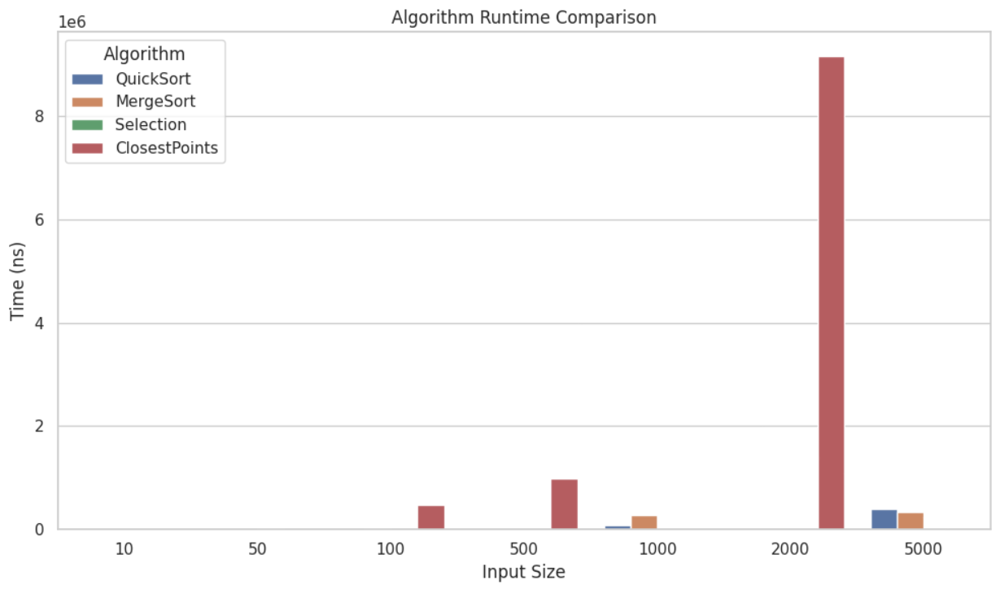
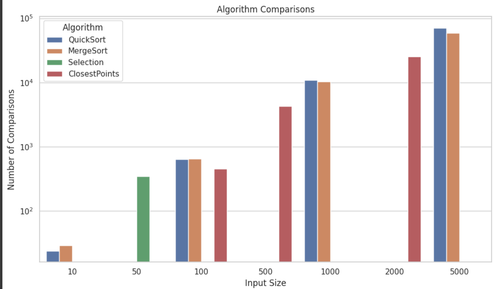
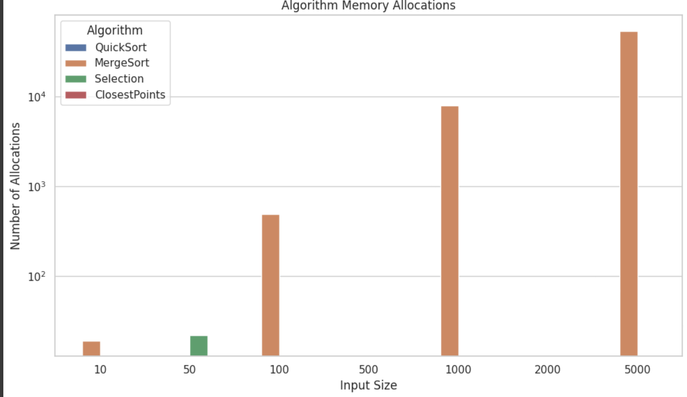
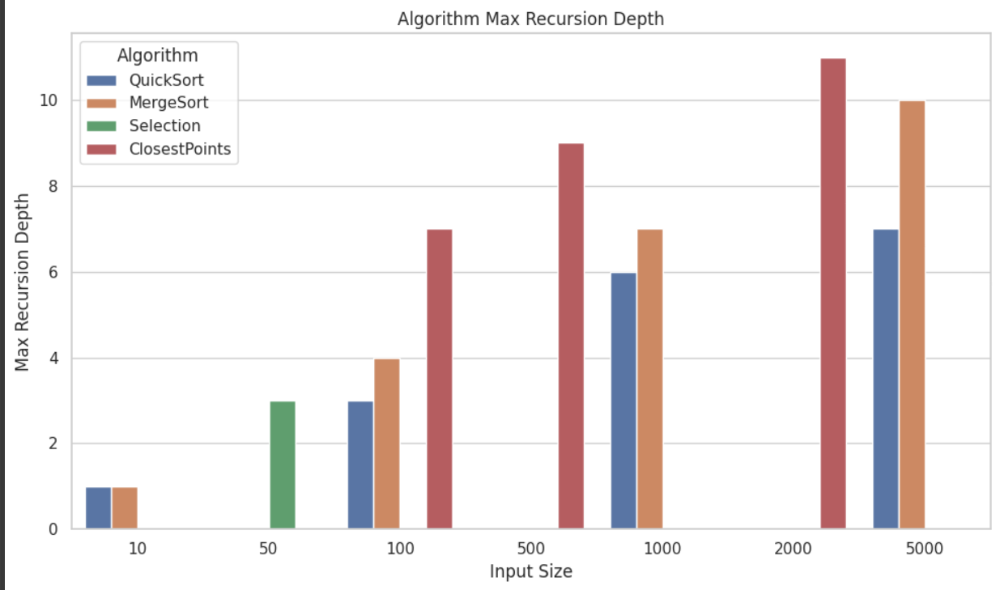

# Assignment 1

## Architecture Notes
This project is implemented in Java using Maven.

## Metrics
Metrics are tracked in a `Metrics` class:
- **Time** (nanoseconds)
- **Comparisons**
- **Allocations**
- **Recursion depth** (tracked via `enterRecursion()` / `leaveRecursion()`)

## Algorithm Details
- **QuickSort**: Depth is limited by always recursing on the smaller partition and iterating on the larger.
- **Memory Optimization**:
  - MergeSort reuses a single buffer array.
  - Deterministic Select and Closest Pair only allocate helper arrays proportional to subproblem size.

---

## Recurrence Analysis

### MergeSort
- The recurrence is `T(n) = 2T(n/2) + Θ(n)` from the two recursive calls and linear merging.
- By the **Master Theorem (Case 2)**, this solves to `Θ(n log n)`.
- A small-`n` cutoff switches to insertion sort to reduce constant factors in practice.

### QuickSort
- The recurrence is `T(n) = T(αn) + T((1-α)n) + Θ(n)`.
- In expectation, α is uniform, leading to `Θ(n log n)` average time by Master intuition.
- Worst-case is `Θ(n^2)` if pivots are poor.
- Recursing only into the smaller side guarantees recursion depth is `O(log n)`.

### Deterministic Select (Median of Medians)
- The recurrence is `T(n) = T(n/5) + T(7n/10) + Θ(n)`.
- By the **Akra–Bazzi Theorem**, this solves to `Θ(n)`.
- Only one recursive call is made, and recursion depth is logarithmic in `n`.

### Closest Pair of Points
- The recurrence is `T(n) = 2T(n/2) + Θ(n)`.
- By the **Master Theorem (Case 2)**, this solves to `Θ(n log n)`.
- The strip step is efficient because only up to ~7–8 neighbors per point are checked.

---

## Plots
### 1. Time vs Input Size
  

---

### 2. Comparisons vs Input Size
  

---

### 3. Allocations vs Input Size
  

---

### 4. Max Recursion Depth vs Input Size
  
